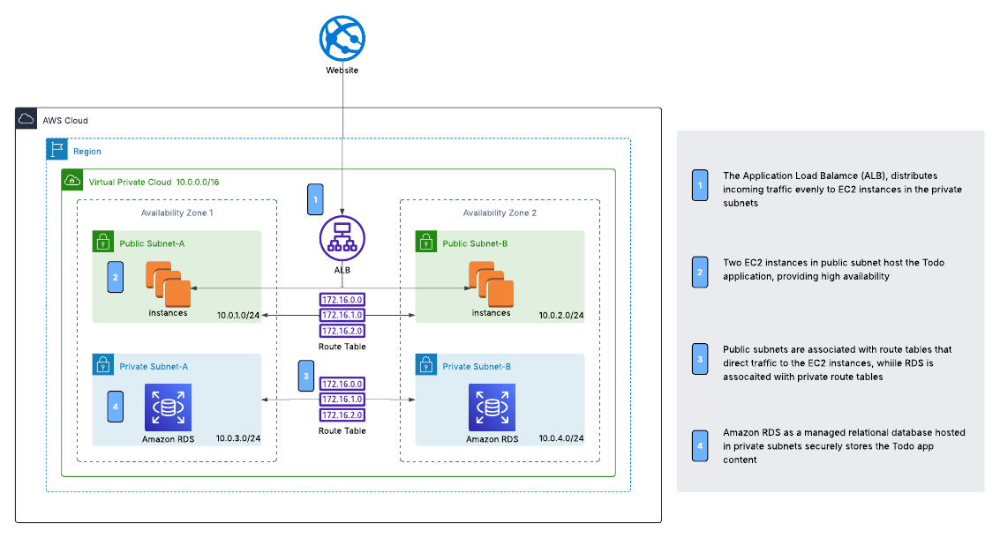
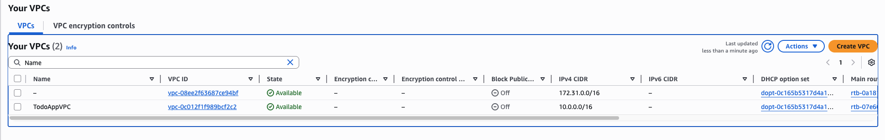
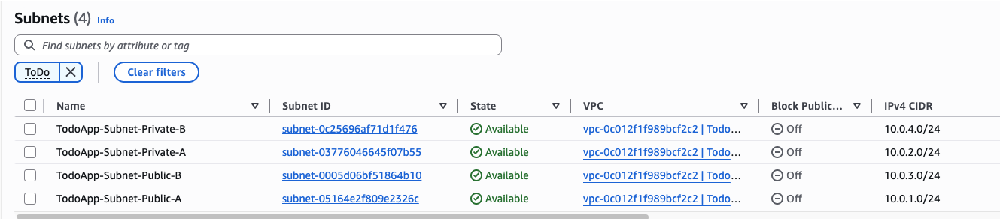
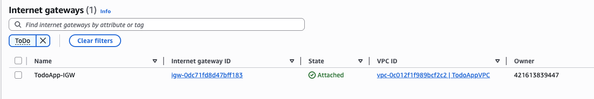
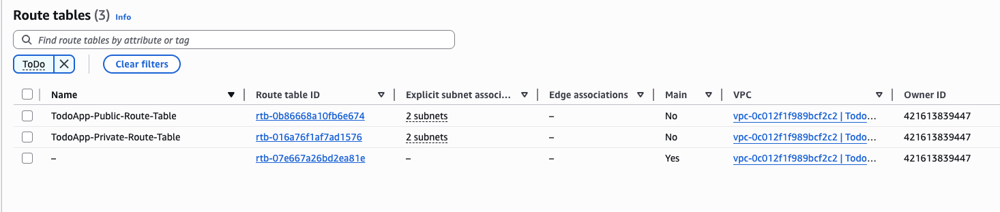
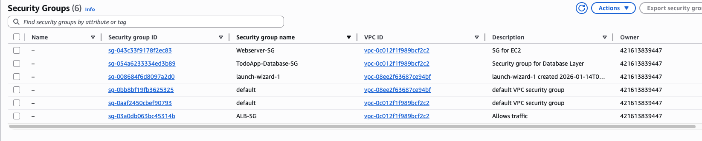
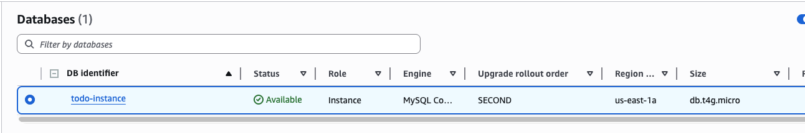
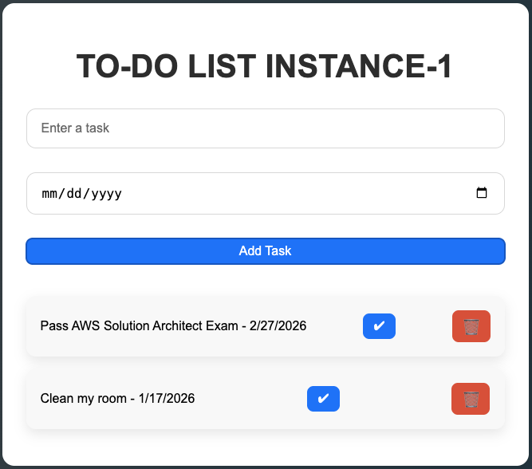
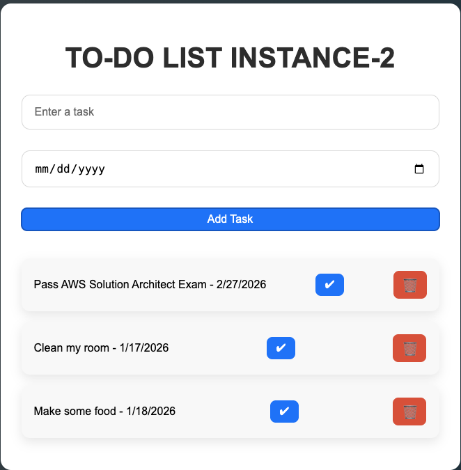

# Two-Tier Website

## 🌟 Overview
This project involves deploying a **To-Do List web application** using a **two-tier architecture on AWS**. The architecture is designed for **scalability, security, and cost-effectiveness** by leveraging **EC2 instances for the application layer** and Amazon RDS for the database layer, with an **Application Load Balancer (ALB)** to distribute traffic.

* **Application Layer**: Two EC2 instances host the Node.js application, ensuring high availability.
* **Database Layer**: Amazon RDS is used to manage a **MySQL database**, storing application data securely.
* **Load Balancing & Routing**: An **Application Load Balancer (ALB)** distributes incoming requests across both EC2 instances for fault tolerance.
* **Security & Networking**: Security Groups, IAM roles, and VPC configurations are implemented for secure communication between components.

### 🛠️ Services used
* **Amazon EC2**: Hosts the web application on two instances for redundancy and performance. **[Compute]**
* **Amazon RDS**: Provides a managed relational database (MySQL) for application data. **[Database]**
* **Application Load Balancer (ALB)**: Distributes traffic across EC2 instances for scalability and reliability. **[Networking]**
* **Amazon VPC**: Ensures secure networking with separate subnets for EC2 and RDS. **[Networking]**
* **IAM Roles and Policies**: Grants necessary permissions for secure interactions between services. **[Security]**
* **Security Groups**: Controls traffic flow between ALB, EC2, and RDS to enforce security. **[Security]**

## ☁️ AWS Architecture

#### Create ToDo VPC

#### Create ToDo subnets

#### Create ToDo internet and attach to the VPC above

#### Create route table to direct traffic

#### Create security gorups to enforce internet traffic access

#### Create db to store data

## &rarr; Final Result
#### Add some task to Instance 1

#### Keep refreshing to get Instance 2 to show

